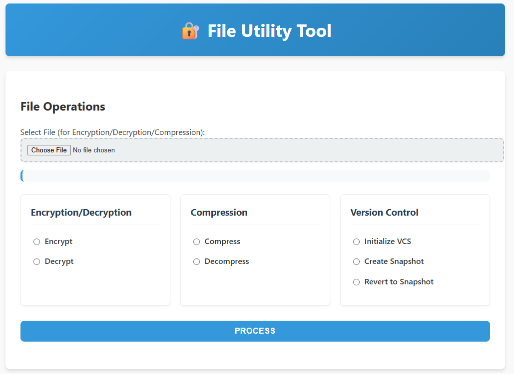

# 🔐 SecureZip

**SecureZip** is a secure and lightweight file management system that provides:

- 🔐 Password-based XOR Encryption & Decryption ( Auto-deletion of files after 3 failed password attempts ) 
- 📦 Huffman Compression & Decompression  
- 🕒 Snapshot-based Version Control (VCS)   

It ensures your files are protected, compressed for storage efficiency, and traceable through manual versioning.

---
## GUI

## Please find the demo video at the bottom or in the repository and click on view raw to download :)
---

## 🚀 Features

### XOR-Based Encryption with Password
- Encrypts files using a **user-provided password** and XOR cipher.
- Requires the exact password to decrypt the file.
- **Security Fail-Safe**: If the password is entered incorrectly **3 times**, the encrypted file is **automatically deleted** to prevent brute-force attacks.

### Compression & Decompression
- Uses **Huffman Coding** to compress files before encryption.
- Decompression restores the file to its original content after decryption.

### Snapshot-based Version Control
- Create **snapshots** of the current file (even encrypted+compressed).
- Each snapshot is mapped to a **short numeric index (starting from 100000)** and a **hash ID**.
- After every snapshot, index increments by 1. eg, **(100000,100001,100002)**.
- Supports **manual reverting** to previous versions using the index.

## Version Control Demo
click on view raw to download the video
🎥 [Click the image above to watch the demo](Version_Control_Demo.mp4)

